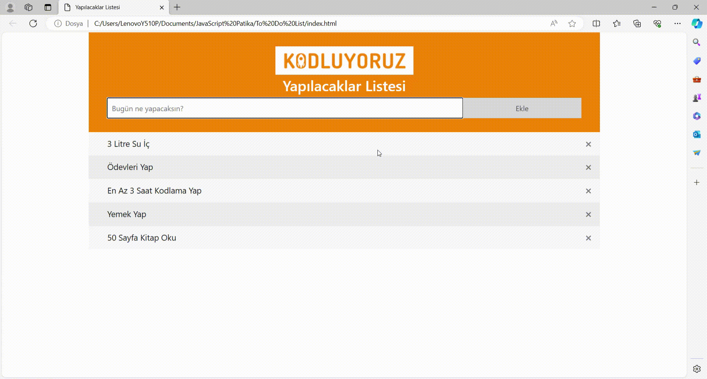

# ToDoList

## Project Overview

In this project, this snippet of code outlines the functionality to add new items to a list element, mark existing items, and remove them using JavaScript within an HTML document.

1. `const myList = document.querySelector("ul");`: Selects the first `<ul>` element in the HTML document and assigns it to the variable `myList`.
2. `var newList = document.querySelectorAll("li");`: Selects all `<li>` elements in the HTML document and assigns them to a NodeList named `newList`.
3. `newList.forEach((item) => { addCloseButton(item); });`: Calls the `addCloseButton` function for each `<li>` element, adding a close button to each item.
4. `function addCloseButton(item) { ... }`: Defines the function used to add a close button to each list item.
5. `item.onclick = () => { item.classList.toggle("checked"); };`: Adds an event listener that toggles the "checked" class on and off when a list item is clicked.
6. `const span = document.createElement("span");`: Creates a new `` element.
7. `span.textContent = "\u00D7";`: Sets the content of the span to "×" (a multiplication sign).
8. `span.className = "close";`: Adds the "close" class to the span element.
9. `item.appendChild(span);`: Appends the close button to the list item.
10. `span.onclick = () => { item.style.display = "none"; };`: Hides the corresponding list item when the close button is clicked.

These 10 lines of code facilitate the creation of a dynamic task list. Users can add new tasks, mark existing tasks, and remove tasks from the list by clicking on the close button.
